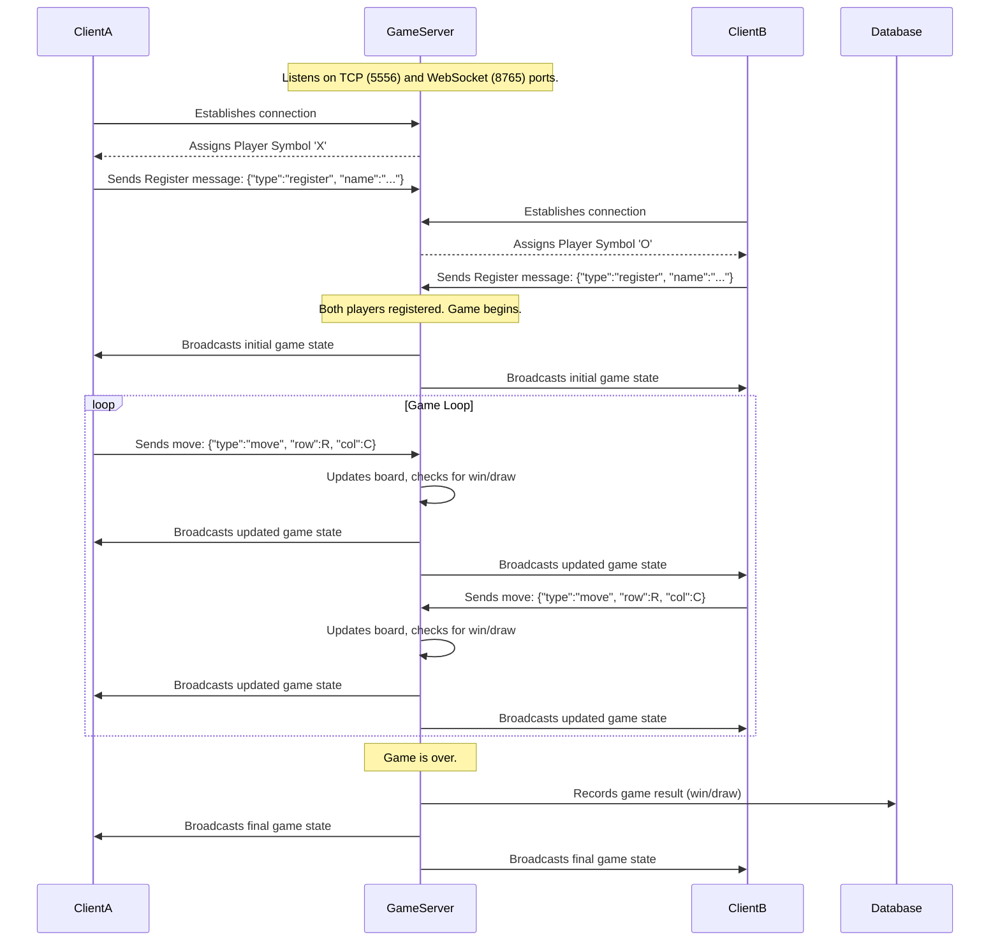
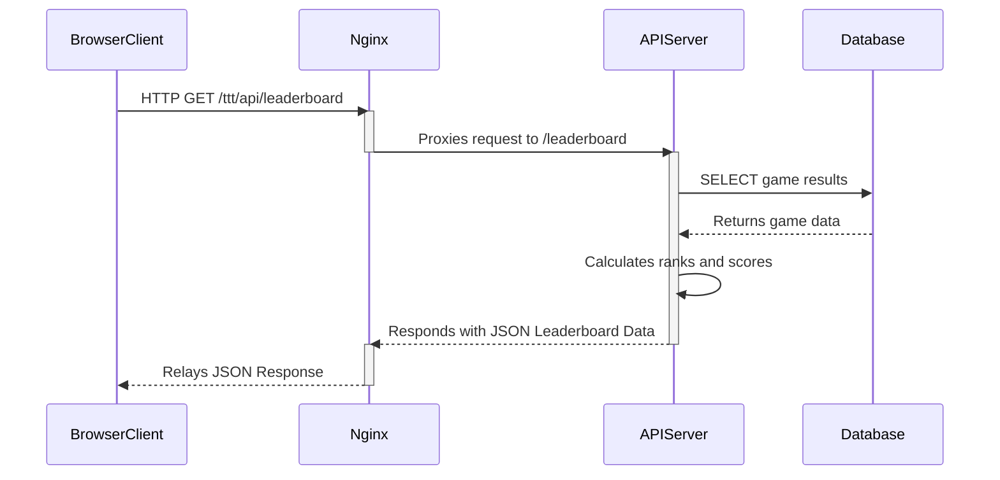

### Gameplay Sequence

```mermaid
sequenceDiagram
    participant ClientA
    participant GameServer
    participant ClientB
    participant Database

    Note over GameServer: Listens on TCP (5556) and WebSocket (8765) ports.

    ClientA->>GameServer: Establishes connection
    GameServer-->>ClientA: Assigns Player Symbol 'X'
    ClientA->>GameServer: Sends Register message: {"type":"register", "name":"..."}

    ClientB->>GameServer: Establishes connection
    GameServer-->>ClientB: Assigns Player Symbol 'O'
    ClientB->>GameServer: Sends Register message: {"type":"register", "name":"..."}

    Note over GameServer: Both players registered. Game begins.
    GameServer->>ClientA: Broadcasts initial game state
    GameServer->>ClientB: Broadcasts initial game state

    loop Game Loop
        ClientA->>GameServer: Sends move: {"type":"move", "row":R, "col":C}
        GameServer->>GameServer: Updates board, checks for win/draw
        GameServer->>ClientA: Broadcasts updated game state
        GameServer->>ClientB: Broadcasts updated game state
        
        ClientB->>GameServer: Sends move: {"type":"move", "row":R, "col":C}
        GameServer->>GameServer: Updates board, checks for win/draw
        GameServer->>ClientA: Broadcasts updated game state
        GameServer->>ClientB: Broadcasts updated game state
    end

    Note over GameServer: Game is over.
    GameServer->>Database: Records game result (win/draw)
    GameServer->>ClientA: Broadcasts final game state
    GameServer->>ClientB: Broadcasts final game state
```

### Leaderboard Viewing Sequence

```mermaid
sequenceDiagram
    participant BrowserClient
    participant Nginx
    participant APIServer
    participant Database

    BrowserClient->>Nginx: HTTP GET /ttt/api/leaderboard
    activate Nginx
    Nginx->>APIServer: Proxies request to /leaderboard
    deactivate Nginx
    
    activate APIServer
    APIServer->>Database: SELECT game results
    Database-->>APIServer: Returns game data
    APIServer->>APIServer: Calculates ranks and scores
    APIServer-->>Nginx: Responds with JSON Leaderboard Data
    deactivate APIServer
    
    activate Nginx
    Nginx-->>BrowserClient: Relays JSON Response
    deactivate Nginx
```