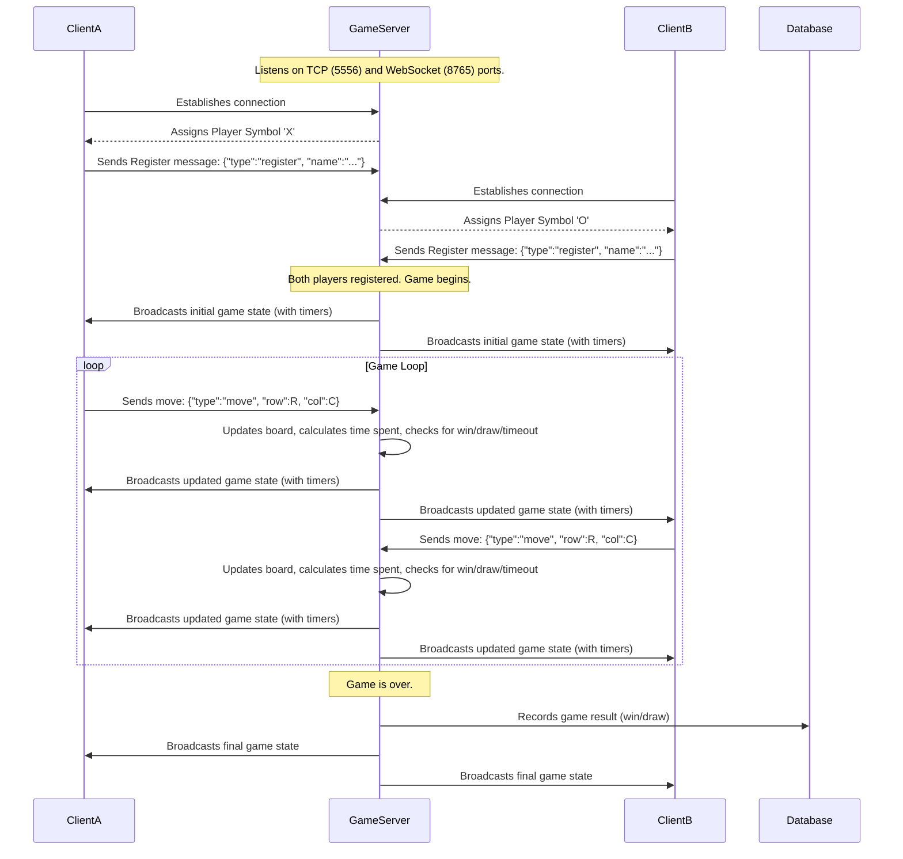
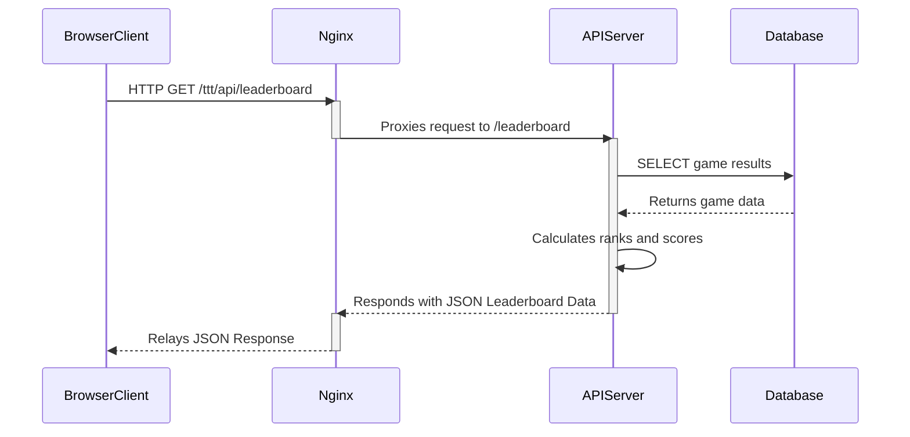
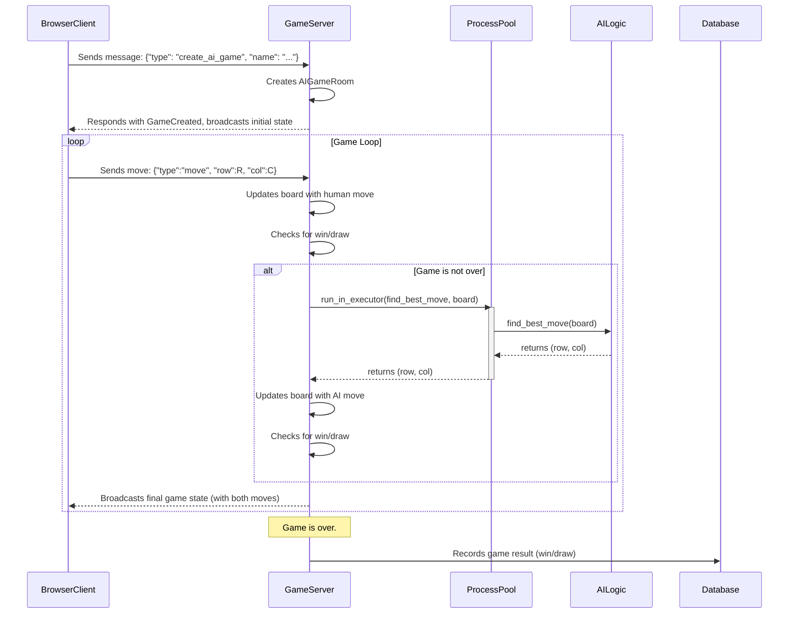

### Gameplay Sequence

```mermaid
sequenceDiagram
    participant ClientA
    participant GameServer
    participant ClientB
    participant Database

    Note over GameServer: Listens on TCP (5556) and WebSocket (8765) ports.

    ClientA->>GameServer: Establishes connection
    GameServer-->>ClientA: Assigns Player Symbol 'X'
    ClientA->>GameServer: Sends Register message: {"type":"register", "name":"..."}

    ClientB->>GameServer: Establishes connection
    GameServer-->>ClientB: Assigns Player Symbol 'O'
    ClientB->>GameServer: Sends Register message: {"type":"register", "name":"..."}

    Note over GameServer: Both players registered. Game begins.
    GameServer->>ClientA: Broadcasts initial game state (with timers)
    GameServer->>ClientB: Broadcasts initial game state (with timers)

    loop Game Loop
        ClientA->>GameServer: Sends move: {"type":"move", "row":R, "col":C}
        GameServer->>GameServer: Updates board, calculates time spent, checks for win/draw/timeout
        GameServer->>ClientA: Broadcasts updated game state (with timers)
        GameServer->>ClientB: Broadcasts updated game state (with timers)
        
        ClientB->>GameServer: Sends move: {"type":"move", "row":R, "col":C}
        GameServer->>GameServer: Updates board, calculates time spent, checks for win/draw/timeout
        GameServer->>ClientA: Broadcasts updated game state (with timers)
        GameServer->>ClientB: Broadcasts updated game state (with timers)
    end

    Note over GameServer: Game is over.
    GameServer->>Database: Records game result (win/draw)
    GameServer->>ClientA: Broadcasts final game state
    GameServer->>ClientB: Broadcasts final game state
```

### Leaderboard Viewing Sequence

```mermaid
sequenceDiagram
    participant BrowserClient
    participant Nginx
    participant APIServer
    participant Database

    BrowserClient->>Nginx: HTTP GET /ttt/api/leaderboard
    activate Nginx
    Nginx->>APIServer: Proxies request to /leaderboard
    deactivate Nginx
    
    activate APIServer
    APIServer->>Database: SELECT game results
    Database-->>APIServer: Returns game data
    APIServer->>APIServer: Calculates ranks and scores
    APIServer-->>Nginx: Responds with JSON Leaderboard Data
    deactivate APIServer
    
    activate Nginx
    Nginx-->>BrowserClient: Relays JSON Response
    deactivate Nginx
```

### "Play vs. Computer" Game Sequence

```mermaid
sequenceDiagram
    participant BrowserClient
    participant GameServer
    participant ProcessPool
    participant AILogic

    BrowserClient->>GameServer: Sends message: {"type": "create_ai_game", "name": "..."}
    GameServer->>GameServer: Creates AIGameRoom
    GameServer-->>BrowserClient: Responds with GameCreated, broadcasts initial state

    loop Game Loop
        BrowserClient->>GameServer: Sends move: {"type":"move", "row":R, "col":C}
        GameServer->>GameServer: Updates board with human move
        GameServer->>GameServer: Checks for win/draw
        
        alt Game is not over
            GameServer->>ProcessPool: run_in_executor(find_best_move, board)
            activate ProcessPool
            ProcessPool->>AILogic: find_best_move(board)
            AILogic-->>ProcessPool: returns (row, col)
            ProcessPool-->>GameServer: returns (row, col)
            deactivate ProcessPool
            
            GameServer->>GameServer: Updates board with AI move
            GameServer->>GameServer: Checks for win/draw
        end
        
        GameServer-->>BrowserClient: Broadcasts final game state (with both moves)
    end

    Note over GameServer: Game is over.
    GameServer->>Database: Records game result (win/draw)
```