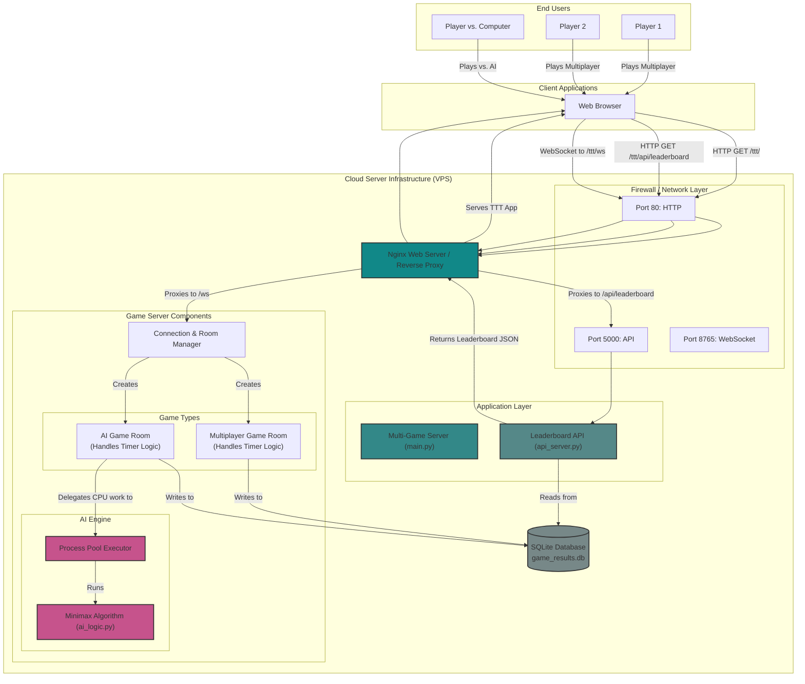

```mermaid
graph TD
    subgraph "End Users"
        UserA[Player 1]
        UserB[Player 2]
        UserC["Player vs. Computer"]
    end

    subgraph "Client Applications"
        direction LR
        Browser[Web Browser]
    end

    subgraph "Cloud Server Infrastructure (VPS)"
        direction TB

        subgraph "Firewall / Network Layer"
            direction LR
            Port80[Port 80: HTTP]
            Port5000[Port 5000: API]
            Port8765[Port 8765: WebSocket]
        end
        
        Nginx[Nginx Web Server / Reverse Proxy]

        subgraph "Application Layer"
            direction LR
            GameServer["Multi-Game Server (main.py)"]
            APIServer["Leaderboard API (api_server.py)"]
        end

        subgraph "Game Server Components"
            direction TB
            RoomManager["Connection & Room Manager"]
            subgraph "Game Types"
                GameRoom["Multiplayer Game Room<br>(Handles Timer Logic)"]
                AIGameRoom["AI Game Room<br>(Handles Timer Logic)"]
            end
            subgraph "AI Engine"
                ProcessPool["Process Pool Executor"]
                Minimax["Minimax Algorithm (ai_logic.py)"]
            end
        end

        Database[(SQLite Database<br>game_results.db)]
    end
    
    UserA -- "Plays Multiplayer" --> Browser
    UserB -- "Plays Multiplayer" --> Browser
    UserC -- "Plays vs. AI" --> Browser

    %% Data Flows
    Browser -- "HTTP GET /ttt/" --> Port80 --> Nginx
    Nginx -- "Serves TTT App" --> Browser

    Browser -- "HTTP GET /ttt/api/leaderboard" --> Port80 --> Nginx
    Nginx -- "Proxies to /api/leaderboard" --> Port5000 --> APIServer
    APIServer -- "Reads from" --> Database
    APIServer -- "Returns Leaderboard JSON" --> Nginx --> Browser

    Browser -- "WebSocket to /ttt/ws" --> Port80 --> Nginx
    Nginx -- "Proxies to /ws" --> RoomManager
    
    RoomManager -- "Creates" --> GameRoom
    RoomManager -- "Creates" --> AIGameRoom
    
    AIGameRoom -- "Delegates CPU work to" --> ProcessPool
    ProcessPool -- "Runs" --> Minimax
    
    GameRoom -- "Writes to" --> Database
    AIGameRoom -- "Writes to" --> Database

    %% Styling
    style Nginx fill:#188,stroke:#333,stroke-width:2px
    style GameServer fill:#388,stroke:#333,stroke-width:2px
    style APIServer fill:#588,stroke:#333,stroke-width:2px
    style Database fill:#788,stroke:#333,stroke-width:2px
    style ProcessPool fill:#c6538c,stroke:#333,stroke-width:2px
    style Minimax fill:#c6538c,stroke:#333,stroke-width:2px
```