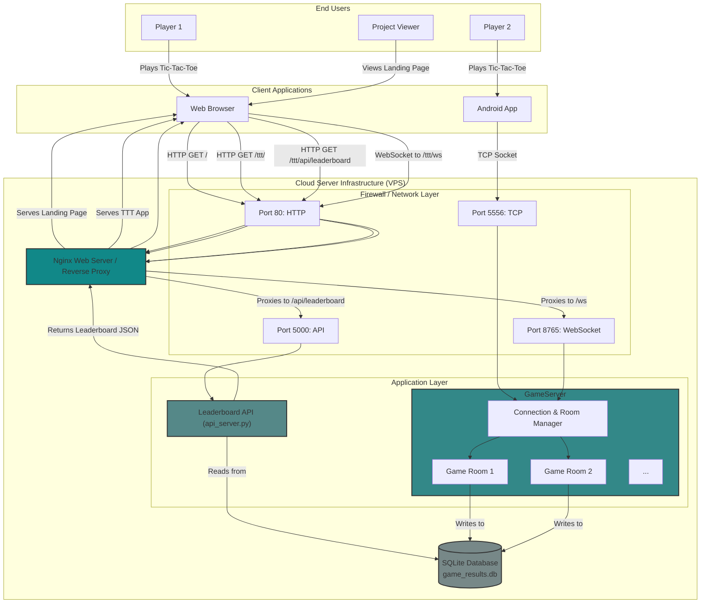

```mermaid
graph TD
    subgraph "End Users"
        UserA[Player 1]
        UserB[Player 2]
        UserC[Project Viewer]
    end

    subgraph "Client Applications"
        direction LR
        Browser[Web Browser]
        Android[Android App]
    end

    subgraph "Cloud Server Infrastructure (VPS)"
        direction TB

        subgraph "Firewall / Network Layer"
            direction LR
            Port80[Port 80: HTTP]
            Port5000[Port 5000: API]
            Port5556[Port 5556: TCP]
            Port8765[Port 8765: WebSocket]
        end
        
        Nginx[Nginx Web Server / Reverse Proxy]

        subgraph "Application Layer"
            direction LR
            GameServer["Multi-Game Server (server.py)"]
            APIServer["Leaderboard API (api_server.py)"]
        end

        Database[(SQLite Database<br>game_results.db)]
        
        subgraph GameServer
            direction TB
            RoomManager["Connection & Room Manager"]
            GameRoom1["Game Room 1"]
            GameRoom2["Game Room 2"]
            GameRoomN["..."]
        end
    end
    
    UserA -- "Plays Tic-Tac-Toe" --> Browser
    UserB -- "Plays Tic-Tac-Toe" --> Android
    UserC -- "Views Landing Page" --> Browser

    %% Data Flows
    Browser -- "HTTP GET /" --> Port80 --> Nginx
    Nginx -- "Serves Landing Page" --> Browser
    
    Browser -- "HTTP GET /ttt/" --> Port80 --> Nginx
    Nginx -- "Serves TTT App" --> Browser

    Browser -- "HTTP GET /ttt/api/leaderboard" --> Port80 --> Nginx
    Nginx -- "Proxies to /api/leaderboard" --> Port5000 --> APIServer
    APIServer -- "Reads from" --> Database
    APIServer -- "Returns Leaderboard JSON" --> Nginx --> Browser

    Android -- "TCP Socket" --> Port5556 --> RoomManager
    Browser -- "WebSocket to /ttt/ws" --> Port80 --> Nginx
    Nginx -- "Proxies to /ws" --> Port8765 --> RoomManager
    
    RoomManager --> GameRoom1
    RoomManager --> GameRoom2
    
    GameRoom1 -- "Writes to" --> Database
    GameRoom2 -- "Writes to" --> Database

    %% Styling
    style Nginx fill:#188,stroke:#333,stroke-width:2px
    style GameServer fill:#388,stroke:#333,stroke-width:2px
    style APIServer fill:#588,stroke:#333,stroke-width:2px
    style Database fill:#788,stroke:#333,stroke-width:2px
```